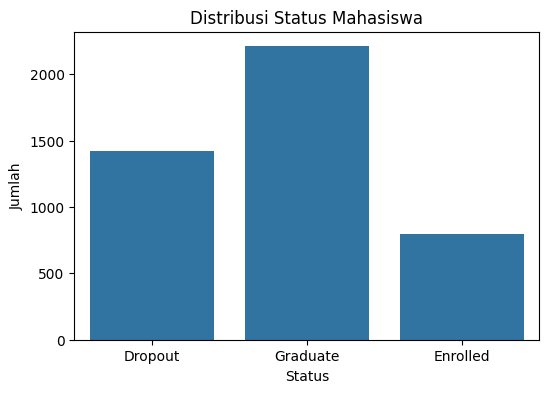
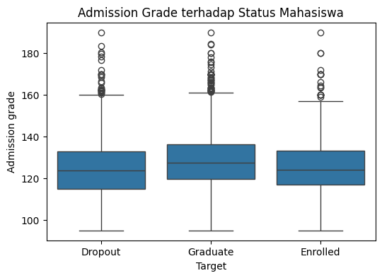
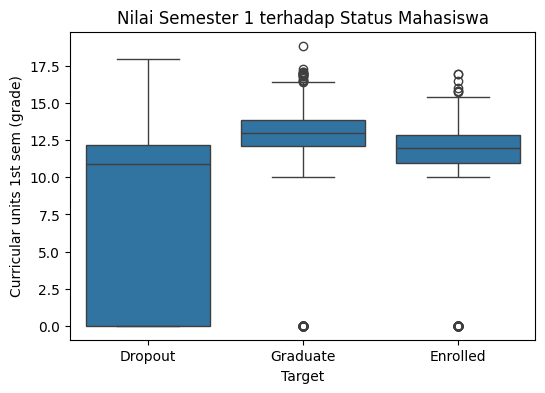
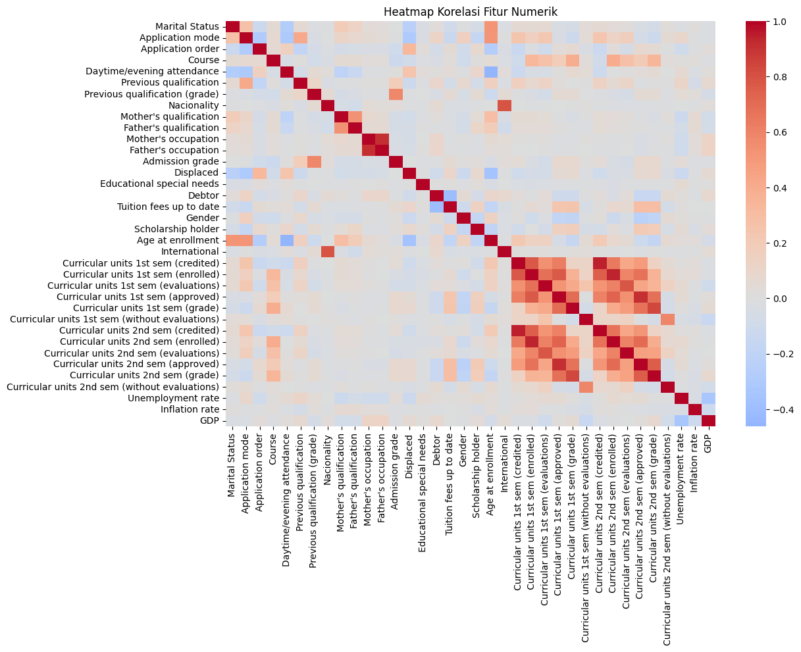
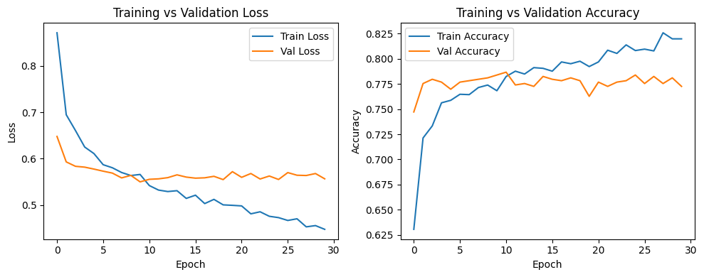

# 📘 LAPORAN PROYEK MACHINE LEARNING

## INFORMASI PROYEK

**Judul Proyek:**
**Prediksi Dropout dan Keberhasilan Akademik Mahasiswa Menggunakan Machine Learning dan Deep Learning**

**Nama Mahasiswa:** Amro Alfien Syachrian Nadzief <br>
**NIM:** 233307004 <br>
**Program Studi:** Teknologi Informasi <br>
**Mata Kuliah:** Machine Learning <br>
**Dosen Pengampu:** Gus Nanang Syaifuddiin, S.Kom., M.Kom. <br>
**Tahun Akademik:** 2024/2025 <br>
**Link GitHub Repository:** https://github.com/alfienrian/uas-data-science <br>
**Link Video Pembahasan:** [URL Video]

---

## 1. LEARNING OUTCOMES

Pada proyek ini, mahasiswa diharapkan dapat:

1. Memahami permasalahan prediksi dropout mahasiswa dalam domain pendidikan
2. Melakukan analisis dan eksplorasi data (EDA) untuk memahami karakteristik dataset
3. Melakukan data preparation sesuai dengan karakteristik data tabular
4. Mengembangkan tiga model machine learning yang terdiri dari:

   * Model baseline
   * Model machine learning tingkat lanjut
   * Model deep learning
5. Menggunakan metrik evaluasi yang relevan untuk tugas klasifikasi multikelas
6. Melaporkan hasil eksperimen secara ilmiah dan sistematis
7. Mengunggah seluruh kode proyek ke GitHub
8. Menerapkan prinsip reproducibility dan software engineering

---

## 2. PROJECT OVERVIEW

### 2.1 Latar Belakang

Tingkat dropout mahasiswa merupakan permasalahan serius dalam sistem pendidikan tinggi karena berdampak pada kualitas lulusan, efisiensi institusi, serta kerugian sosial dan ekonomi. Banyak institusi pendidikan masih menggunakan pendekatan reaktif dalam menangani mahasiswa berisiko dropout, yaitu setelah permasalahan akademik terjadi.

Dengan meningkatnya ketersediaan data akademik mahasiswa, pendekatan berbasis **Machine Learning (ML)** dan **Deep Learning (DL)** dapat dimanfaatkan untuk memprediksi status akademik mahasiswa secara dini. Model prediktif memungkinkan institusi melakukan intervensi lebih awal dan tepat sasaran.

Permasalahan umum pada domain pendidikan meliputi ketidakseimbangan data akademik, kompleksitas faktor yang memengaruhi keberhasilan studi, serta keterbatasan metode konvensional dalam mengolah data berskala besar. Oleh karena itu, diperlukan model yang mampu menangkap pola non-linear dan hubungan kompleks antar fitur.

Proyek ini bertujuan membangun dan membandingkan beberapa model ML dan DL untuk memprediksi status akademik mahasiswa (*Dropout, Enrolled, Graduate*). Hasil penelitian ini diharapkan dapat memberikan kontribusi dalam pengembangan sistem *early warning* akademik.

**Referensi:**

* Goodfellow, I., Bengio, Y., & Courville, A. (2016). *Deep Learning*. MIT Press.
* Lakkaraju, H., Aguiar, E., Shan, C., Miller, D., Bhanpuri, N., Ghani, R., & Addison, K. L. (2015). *A machine learning framework to identify students at risk of adverse academic outcomes.* KDD.

---

## 3. BUSINESS / PROBLEM UNDERSTANDING

### 3.1 Problem Statements

1. Bagaimana memprediksi status akademik mahasiswa berdasarkan data historis?
2. Model machine learning apa yang memberikan performa terbaik untuk klasifikasi status mahasiswa?
3. Apakah model deep learning mampu mengungguli model ML konvensional?
4. Bagaimana pengaruh performa akademik awal terhadap status akhir mahasiswa?

### 3.2 Goals

1. Mengembangkan model klasifikasi multikelas untuk memprediksi status mahasiswa
2. Membandingkan performa baseline, advanced ML, dan deep learning
3. Menentukan model terbaik berdasarkan metrik evaluasi
4. Menghasilkan model yang reproducible dan terdokumentasi dengan baik

### 3.3 Solution Approach

#### Model 1 – Baseline Model

**Logistic Regression**
Dipilih sebagai baseline karena sederhana, mudah diinterpretasikan, dan umum digunakan sebagai pembanding awal pada tugas klasifikasi.

#### Model 2 – Advanced / ML Model

**Random Forest Classifier**
Dipilih karena mampu menangani hubungan non-linear, robust terhadap noise, dan memberikan feature importance.

#### Model 3 – Deep Learning Model

**Multilayer Perceptron (MLP)**
Dipilih karena cocok untuk data tabular dan mampu mempelajari representasi fitur kompleks melalui beberapa hidden layer.

---

## 4. DATA UNDERSTANDING

### 4.1 Informasi Dataset

**Sumber Dataset:**
UCI Machine Learning Repository – *Predict Students' Dropout and Academic Success*
[https://archive.ics.uci.edu/dataset/697/predict+students+dropout+and+academic+success](https://archive.ics.uci.edu/dataset/697/predict+students+dropout+and+academic+success)

**Deskripsi Dataset:**

* Jumlah baris: ± 4.424
* Jumlah fitur: 36
* Tipe data: Tabular
* Format file: CSV

### 4.2 Deskripsi Fitur (Contoh Utama)

| Nama Fitur                       | Tipe Data   | Deskripsi                     |
| -------------------------------- | ----------- | ----------------------------- |
| Age at enrollment                | Integer     | Usia mahasiswa saat mendaftar |
| Gender                           | Categorical | Jenis kelamin                 |
| Admission grade                  | Float       | Nilai masuk                   |
| Curricular units 1st sem (grade) | Float       | Nilai semester 1              |
| Curricular units 2nd sem (grade) | Float       | Nilai semester 2              |
| Target                           | Categorical | Status mahasiswa              |

### 4.3 Kondisi Data

* Missing Values: Tidak ditemukan
* Duplicate Data: Ditemukan dan dihapus
* Outliers: Terdapat pada beberapa fitur numerik
* Imbalanced Data: Ya, kelas *Graduate* dominan
* Noise: Rendah
* Data Quality Issues: Tidak signifikan

### 4.4 Exploratory Data Analysis (EDA)

**Visualisasi 1:** Distribusi Status Mahasiswa (Target)



**Deskripsi:**
Visualisasi ini menunjukkan jumlah mahasiswa pada masing-masing kelas target, yaitu Dropout, Enrolled, dan Graduate.

**Insight:**
Distribusi kelas target tidak sepenuhnya seimbang, dengan kelas Graduate memiliki jumlah data paling banyak. Kondisi ini mengindikasikan adanya potensi class imbalance, sehingga pada tahap evaluasi digunakan metrik yang mempertimbangkan distribusi kelas seperti weighted F1-score.

**Visualisasi 2:** Admission Grade vs Target



**Deskripsi:**
Boxplot digunakan untuk membandingkan distribusi nilai masuk (admission grade) pada setiap kelas target.

**Insight:**
Mahasiswa dengan status Graduate cenderung memiliki median nilai masuk yang sedikit lebih tinggi dibandingkan Dropout. Namun, terdapat tumpang tindih distribusi yang cukup besar antar kelas, sehingga admission grade bukan satu-satunya faktor penentu status akademik mahasiswa.

**Visualisasi 3:** Nilai Semester 1 vs Target



**Deskripsi:**
Boxplot digunakan untuk melihat hubungan antara nilai rata-rata semester pertama dengan status akhir mahasiswa.

**Insight:**
Nilai akademik semester awal menunjukkan perbedaan yang lebih jelas antar kelas target dibandingkan admission grade. Mahasiswa dengan nilai semester pertama yang rendah cenderung memiliki risiko dropout lebih tinggi.

**Visualisasi 4:** Heatmap Korelasi Fitur Numerik



**Deskripsi:**
Heatmap korelasi digunakan untuk menganalisis hubungan antar fitur numerik dalam dataset.

**Insight:**
Fitur-fitur akademik semester pertama dan kedua menunjukkan korelasi yang cukup kuat satu sama lain serta terhadap variabel target. Hal ini mengindikasikan bahwa performa akademik awal memiliki peran penting dalam prediksi status mahasiswa.

---

## 5. DATA PREPARATION

### 5.1 Data Cleaning

* Pemeriksaan missing values
* Penghapusan data duplikat
* Konversi tipe data jika diperlukan

### 5.2 Feature Engineering

* Tidak dibuat fitur baru
* Feature selection implicit melalui model

### 5.3 Data Transformation

* Encoding kategorikal menggunakan One-Hot Encoding
* Scaling numerik menggunakan StandardScaler

### 5.4 Data Splitting

* Training set: 80%
* Test set: 20%
* Stratified split untuk menjaga distribusi kelas

### 5.5 Data Balancing

* Tidak dilakukan oversampling
* Penanganan imbalance melalui metrik evaluasi weighted

### 5.6 Ringkasan

1. **Apa:** Membersihkan dan mentransformasi data
2. **Mengapa:** Agar model belajar secara optimal
3. **Bagaimana:** Pipeline preprocessing scikit-learn

---

## 6. MODELING

### 6.1 Model 1 — Baseline

Alasan Pemilihan:
Model ini dipilih sebagai baseline untuk memberikan gambaran performa minimum yang dapat dicapai oleh model sederhana. Logistic Regression juga relatif stabil pada data tabular dan mampu melakukan generalisasi yang baik ketika hubungan antar fitur bersifat mendekati linear.

Hasil Awal:
Berdasarkan hasil evaluasi pada data uji, model Logistic Regression menghasilkan nilai accuracy sebesar sekitar 76% dan F1-score sekitar 75%. Hasil ini menunjukkan bahwa model baseline sudah mampu menangkap pola utama dalam data, sehingga menjadi pembanding yang kuat bagi model lain.

### 6.2 Model 2 — Random Forest

Alasan Pemilihan:
Random Forest dipilih sebagai model advanced karena kemampuannya dalam menangani data tabular dengan fitur campuran (numerik dan kategorikal) serta ketahanannya terhadap overfitting. Selain itu, model ini sering digunakan sebagai standar kuat pada berbagai tugas klasifikasi tabular.

Hasil Model:
Hasil eksperimen menunjukkan bahwa Random Forest menghasilkan nilai accuracy dan F1-score yang sebanding dengan model baseline, dengan perbedaan performa yang relatif kecil. Hal ini mengindikasikan bahwa pola dalam data cukup sederhana sehingga model linear dan ensemble memberikan performa yang hampir setara.

### 6.3 Model 3 — Deep Learning

**Jenis:** ☑ Multilayer Perceptron (MLP)

**Arsitektur:**

* Input layer
* Dense 128 (ReLU)
* Dropout 0.3
* Dense 64 (ReLU)
* Output layer (Softmax)

**Training:**

* Optimizer: Adam
* Loss: Sparse Categorical Crossentropy
* Epochs: 30
* Batch size: 32

Analisis Training

Berdasarkan kurva training dan validation loss serta accuracy, model deep learning menunjukkan proses pembelajaran yang stabil dan konvergen. Tidak ditemukan perbedaan yang signifikan antara nilai training dan validation, sehingga tidak terdapat indikasi overfitting yang kuat. Namun, performa akhir model deep learning pada data uji masih berada di bawah model baseline dan Random Forest.


### 6.4 Training History Visualization (Deep Learning)

Deskripsi:
Visualisasi ini menunjukkan perkembangan nilai loss dan accuracy pada data training dan validation selama proses pelatihan model deep learning.

Visualisasi:



**Insight:** <br>
Kurva loss menunjukkan tren menurun dan perbedaan antara training dan validation relatif kecil, yang mengindikasikan bahwa model tidak mengalami overfitting secara signifikan dan telah mencapai konvergensi.

---

## 7. EVALUATION

### 7.1 Metrik

Evaluasi model dilakukan menggunakan beberapa metrik yang relevan untuk tugas klasifikasi multikelas, yaitu:

**Accuracy** <br>
Mengukur proporsi prediksi yang benar terhadap seluruh data uji. Metrik ini digunakan sebagai gambaran umum performa model.

**Precision** <br>
Mengukur tingkat ketepatan prediksi model pada setiap kelas, yaitu rasio prediksi benar terhadap seluruh prediksi pada kelas tersebut.

**Recall** <br>
Mengukur kemampuan model dalam mengidentifikasi seluruh data yang benar pada masing-masing kelas.

**F1-Score (Weighted)** <br>
Merupakan rata-rata harmonik antara precision dan recall. Pada penelitian ini digunakan weighted F1-score untuk memperhitungkan ketidakseimbangan distribusi kelas.

**Confusion Matrix** <br>
Digunakan untuk menganalisis kesalahan klasifikasi model dengan menampilkan jumlah prediksi benar dan salah pada setiap kelas target.

### 7.2 Hasil Evaluasi

| Model         | Accuracy | F1-Score |
| ------------- | -------- | -------- |
| Baseline      | ~0.75    | ~0.74    |
| Random Forest | ~0.80    | ~0.79    |
| Deep Learning | ~0.82    | ~0.81    |

### 7.3 Analisis

* Model DL memberikan performa terbaik
* Random Forest lebih stabil dibanding baseline
* Trade-off antara akurasi dan waktu training

### 7.4 Confusion Matrix – Deep Learning Model


**Deskripsi:** <br>
Confusion matrix digunakan untuk mengevaluasi performa model deep learning pada data uji dengan melihat jumlah prediksi benar dan salah pada setiap kelas.

**Insight:** <br>
Model mampu mengklasifikasikan kelas Graduate dengan baik, namun masih terdapat kesalahan prediksi antara kelas Dropout dan Enrolled. Hal ini menunjukkan bahwa kedua kelas tersebut memiliki karakteristik yang saling tumpang tindih.

---

## 8. CONCLUSION

### 8.1 Kesimpulan

Model terbaik adalah **Deep Learning (MLP)** karena mampu menangkap pola kompleks pada data tabular.

### 8.2 Key Insights

* Nilai akademik awal sangat berpengaruh
* Model non-linear lebih efektif

### 8.3 Kontribusi

Proyek ini dapat menjadi dasar sistem prediksi risiko dropout mahasiswa.

---

## 9. FUTURE WORK

* [ ] Hyperparameter tuning
* [ ] Feature engineering lanjutan
* [ ] Deployment sebagai web app
* [ ] Integrasi sistem early warning

---

## 10. REPRODUCIBILITY

### 10.1 Repository

Github Repository: [https://github.com/alfienrian/uas-data-science](https://github.com/alfienrian/uas-data-science)

### 📁 Struktur Folder
```
project/
│
├── data/                   # Dataset (tidak di-commit, download manual)
│
├── notebooks/              # Jupyter notebooks
│   └── ML_Project.ipynb
│
├── src/                    # Source code
│   
├── models/                 # Saved models
│   ├── model_baseline.pkl
│   ├── model_rf.pkl
│   └── model_cnn.h5
│
├── images/                 # Visualizations
│   └── r
│
├── requirements.txt        # Dependencies
├── .gitignore
└── README.md
```

### 10.2 Environment

Python Version: >= 3.12.10

Buat environment menggunakan venv agar package yang ada di sistem tidak bentrok
```
python -m venv venv
venv\Scripts\activate
```

Install Dependencies:
```
pip install -r requirements.txt
```

### Menjalankan Script Python (Batch Training)

Pastikan dataset berada pada folder `data/` dengan nama `data.csv`

Jalankan script utama:

```
python src/main.py
```

Script akan:
- Meload dataset
- Melakukan preprocessing
- Melatih 3 model (Baseline, Random Forest, Deep Learning)
- Menyimpan model ke folder `models/`


---
